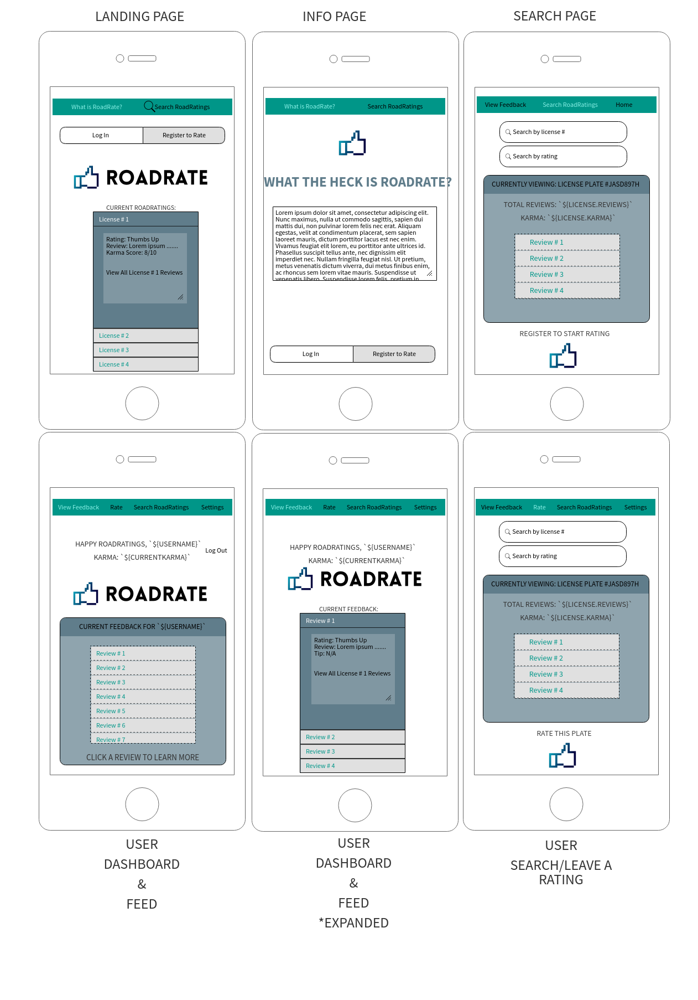

# RoadRate
Choose Rate, not Rage

Your driving is now public information. Leave reviews, ratings, comments, and tips for drivers. Learn how your driving effects others and make the roads safer

## Quick Links
- [Client Repo](https://github.com/thinkful-ei26/roadrate-client)
- [Server Repo](https://github.com/thinkful-ei26/roadrate-server)
- [Deployed Client](#placeholder)
- [Deployed Server](#placeholder) 

## MVP
Should be deployable by Monday, 2/18/19

*For Next Monday*
- User Reg/Auth/Login
- Info Modal/User Onboarding on landing page
- Users can leave public reviews
The app has a rating system where users can select good or bad
- Users have basic CRUD functionality for their submissions
A tab for “My Reviews”
- Users are shown reviews about them if applicable
- A tab for “Reviews About Me”
- Public reviews are accessible by anyone
- Filter feature for reviews by license plate #

## Tech Stack
- **Front End:** React/Redux, CSS, HTML
- **Back End:** Node.js, Express, mLab
- **Testing:** Mocha/Chai

## Roles
- **Design Lead:** Jordan
- **Project Manager:** Trisha
- **QA Lead:** RP
- **Product Manager:** Randy

## User Stories/Hierarchy

1. Landing Page with app info for user onboarding
- Header, App Info, what the app is about and how to use it
- Registration/Login links
- Has recent reviews displaying below see #6

2. User Reg/Auth/Login
- Registration form appears for new users
- User submits basic information (name, username, password, email) & optional linking of one license plate (license plate number) & vehicle classification
- User gets redirected to user dashboard
- User should be able to log out
- Validate User Info
  - Unique usernames
  - Unique license plates
  - Password matches/meets requirements
  - JWT/bcrypt

3. Dashboard
- Registered users can post reviews
  - Review form
  - Username of reviewer
  - License plate # to review
  - Rating: checkbox w/ positive/negative/neutral
  - Text Box for comments/reviews
  - Dashboard has option to link/update license plate
  - Dashboard has a review feed

4. Registered users can view their submitted reviews
- Get endpoint for reviews using a user id

5. Registered users can view reviews submitted about them
- Get endpoint for reviews using a license id/search query

6. All reviews are viewable by anyone on landing page
- Get endpoint for recent reviews

7. Filter feature for reviews by license plate #
- Search bar at top of the review feed

## Considerations: 
- Anonymous reviews, personal information should not be at risk etc. 
- Cap responses
- As an owner, I can see what people are saying about me and hopefully it improves my capabilities 
- Users should be triggered enough to leave a negative review or inspired enough to leave a positive review
- No css grid/no ems/no bootstrap
- px & % are ok for horizontal, px and vh for vertical measurements
- Materialize OK, flexbox OK
- [TJ’s flexbox material](https://docs.google.com/document/d/16FepalC5m0DIjKtpvnJed5wZ34IhBrRKrdvcuOI8oU8/edit)
- Mongo/MongoDB over mLab

## Additional Features:
- Anonymous tipping feature 
- Karma Score feature

## Wireframes

