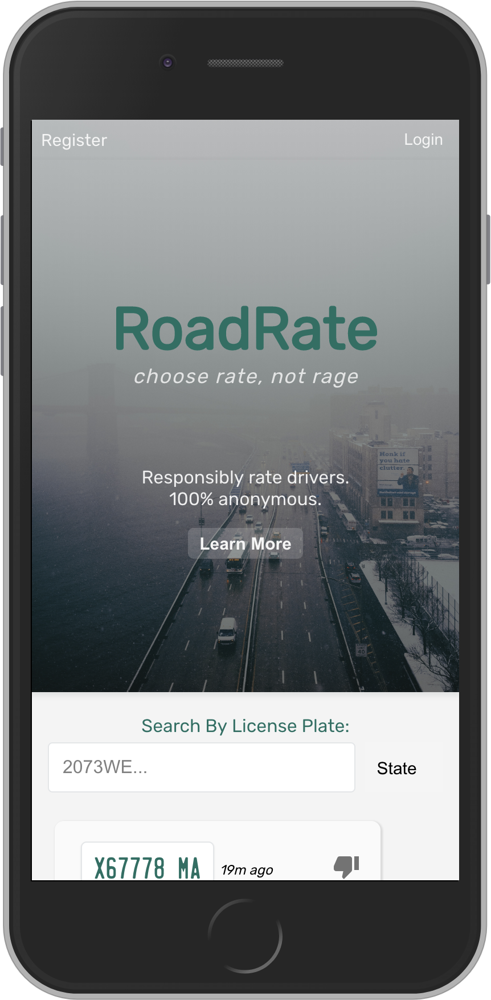

# RoadRate
<div align="center">
  
</div>
<p align="center">Choose Rate, not Rage</p>

## What is RoadRate?
**Have you ever been perplexed by a neighbor that continuously parks in a way that blocks you from using an otherwise perfectly viable space?**

With RoadRate, you can find their license plate, rate it, and leave an anonymous review.

**What about that time you relied on the help of a stranger for a jump?**

You can use RoadRate to publically acknowledge how impactful the kindness of strangers can be.

Our team developed RoadRate so that drivers can communicate with each other about the road. With a simple click of a button you can get your points across anonymously. 

## What is RoadRate?
RoadRate is a social platform for reviewing your fellow drivers and seeing how well your own plate's *RoadRate. Register license plates, browse/search/post reviews, and build up your karma score to let other's know you're a great driver. RoadRate was founded to safely and anonymously encourage quality road etiquette for the over 220 million drivers currently licensed in America.

*RoadRate encourages positive reviews for enviable driving skills and random acts of kindness, and as such, honest negative reviews where there is room for improvement and need are also encouraged.

For version 2, we want to incorporate a tipping feature to encourage rewards for good driving.

## Quick Links
- [Client Repo](https://github.com/thinkful-ei26/roadrate-client)
- [Server Repo](https://github.com/thinkful-ei26/roadrate-server)
- [Deployed Client](https://road-rate-client.herokuapp.com/)
- [Deployed Server](http://road-rate-server.herokuapp.com/) 
- [Presentation Link](https://slides.com/ohmyquad/deck/live#/roadrate)

## ScreenShot


## V1 Features

**All Users:**
- User Registration/Auth/Login using jwt authToken
- User on-boarding on the landing page via an `About` modal
- Users can view reviews about a plate without registering an account 
- Users can search for a License plate number and view the reviews written about it
- Public reviews are accessible by anyone

**Registered Users:**
- Registered users can leave public reviews anonymously about a plate
- Registered users can claim and unclaim a license plate
- Once a registered user claims a plate, they can see the associated reviews about all of their claimed plates in the "My Plates" tab
- Registered users can also view all of the reviews or feedback they have written about other license plates in a tab called “My Reviews”

## V2 Features
- Registered users can send and receive anonymous tips via a claimed license plate
- Karma Score Gamification
- Infinite scroll and pagination
- Fix the `owned by a user` icon on review cards. The icon should render dynamically if the plate is actually claimed

## Tech Stack
**Front End:** 
  - [Create React App](https://github.com/facebook/create-react-app)
  - [React](https://github.com/facebook/react)
  - [React Hooks](https://reactjs.org/docs/hooks-intro.html)
  - [CSS](https://developer.mozilla.org/en-US/docs/Web/CSS)

**Back End:** 
  - [Node](https://github.com/nodejs/node)
  - [Express](https://github.com/expressjs/express)
  - [Passport](http://www.passportjs.org/)
  - [MongoDB](https://github.com/mongodb/mongo)
  - [Mongoose](https://github.com/Automattic/mongoose)
  - [MongoDB Atlas](https://www.mongodb.com/cloud/atlas)

**Testing:** 
  - [Mocha](https://mochajs.org/)
  - [Chai](https://www.chaijs.com/)

**Workflow** 
  - [Agile](https://www.agilealliance.org/)/[Scrum](https://www.scrum.org/)
  - Check out the [Road Rate Trello Board](https://trello.com/b/Zc46dooe/oh-my-quad)

## Team
- **Jordan Haddadi** - Design Lead <a href="https://github.com/jordanhaddadi" target="_blank"></a>
- **Randy Sartor** - Product Manager <a href="https://github.com/Rjsartor" target="_blank"></a>
- **RP Boyle** - QA Lead <a href="https://github.com/RPBoyle11" target="_blank"></a>
- **Trisha Aguinaldo** - Project Manager <a href="https://github.com/kronicle114" target="_blank"></a>

## API

```
/api
.
├── /auth
│   └── POST
│       ├── /login
│       └── /refresh
├── /users
│   └── POST
│       └── /
├── /plates
│   └── GET
│       ├── /
│       ├── /:id
│       ├── /all/:id
│       ├── /:plateState/:plateNumber
│   └── POST
│       └── /
│   └── PUT
│       ├── /:userId
│       ├── /unclaim/:userId
├── /reviews
│   └── GET
│       └── /
│       ├── /my-plates/:plateId
│       ├── /plate/:plateId
│       ├── /:plateState/:plateNumber
│       ├── /:userId     <-- GET all reviews by userId
│       ├── /:id         <-- GET one review by reviewId
│   └── POST
│       └── /
│   └── PUT
│       └── /:id
```

## Twitter/ProductHunt
- [Twitter](https://twitter.com/RoadRateNow)   
- [ProductHunt](#)  

## Wireframes


